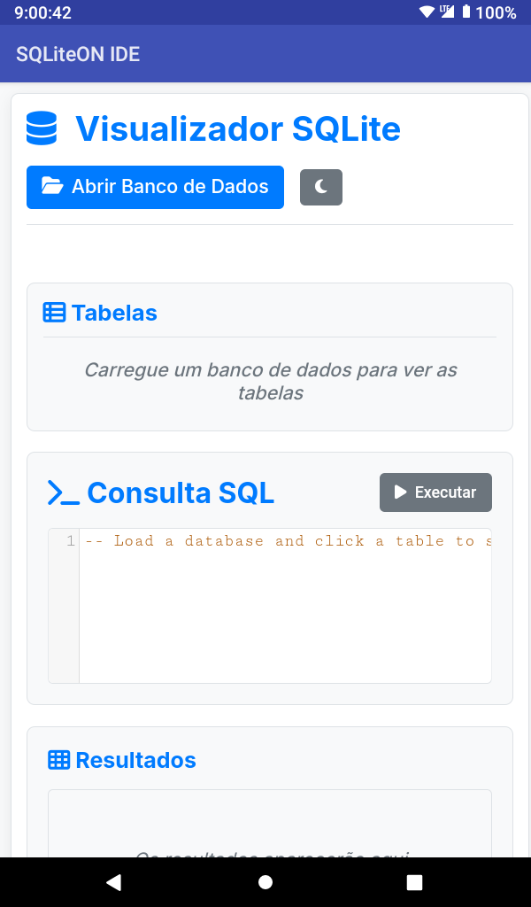
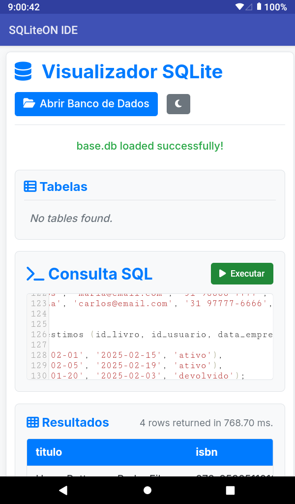
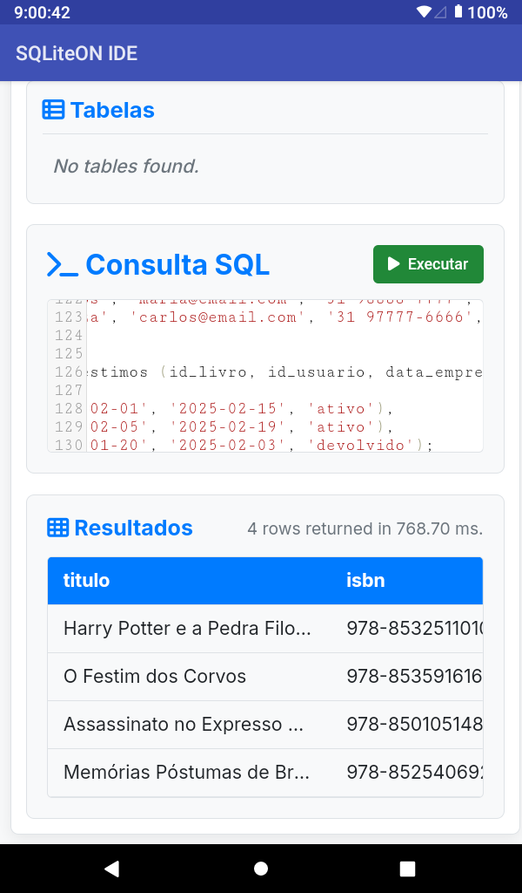

# SQLite Tool (APK)

**Android SQLite Tool** é um aplicativo Android completo para gerenciar bancos de dados SQLite diretamente no seu dispositivo. Compile novos bancos a partir de arquivos, visualize tabelas, carregue dados e execute consultas SQL de forma simples e intuitiva.

## 📱 Funcionalidades

- **📦 Compilação de SQLite**: Crie bancos de dados SQLite a partir de arquivos CSV, JSON ou texto no seu armazenamento.
- **📊 Visualização de tabelas**: Explore a estrutura e os dados de todas as tabelas de um banco existente.
- **📤 Carregamento de dados**: Importe registros para tabelas existentes ou crie novas tabelas durante a importação.
- **🔍 Execução de SQL**: Execute consultas personalizadas e veja os resultados em tempo real.
- **📁 Gerenciador de arquivos integrado**: Navegue pelos arquivos do dispositivo para selecionar bancos e fontes de dados.
- **🌙 Tema escuro e claro**: Interface adaptável à preferência do sistema.

## 📲 Instalação

### Via APK (recomendado)
1. Baixe a última versão do APK na seção
2. No seu dispositivo Android, permita a instalação de fontes desconhecidas (vá em Configurações > Segurança > Instalar apps desconhecidos e habilite para o navegador ou gerenciador de arquivos).
3. Abra o arquivo APK baixado e confirme a instalação.

## 🎮 Como usar

### Tela principal
- **Abrir banco**: Toque em "Abrir" e navegue até um arquivo `.db` ou `.sqlite`.
- **Novo banco**: Toque em "Novo" para criar um banco vazio ou a partir de um arquivo de dados.

### Compilar banco de dados
1. Na tela inicial, selecione "Compilar de arquivo".
2. Escolha o arquivo de origem (CSV, JSON, TXT).
3. Defina o nome do banco e da tabela (opcional).
4. Ajuste as opções de delimitador (para CSV) e codificação.
5. Toque em "Compilar" – o banco será gerado e aberto automaticamente.

### Visualizar tabelas
- Após abrir um banco, a lista de tabelas é exibida.
- Toque em uma tabela para ver suas primeiras linhas.
- Use as abas para alternar entre "Dados", "Estrutura" e "SQL".

### Executar SQL
- Na aba "SQL", digite sua consulta (ex.: `SELECT * FROM clientes`).
- Toque em "Executar" – os resultados aparecem logo abaixo.
- Consultas de modificação (INSERT, UPDATE, DELETE) também são suportadas.

## 📸 Capturas de tela

| Tela principal | Visualização de tabela | Execução SQL |
|----------------|------------------------|--------------|
|  |  |  |
